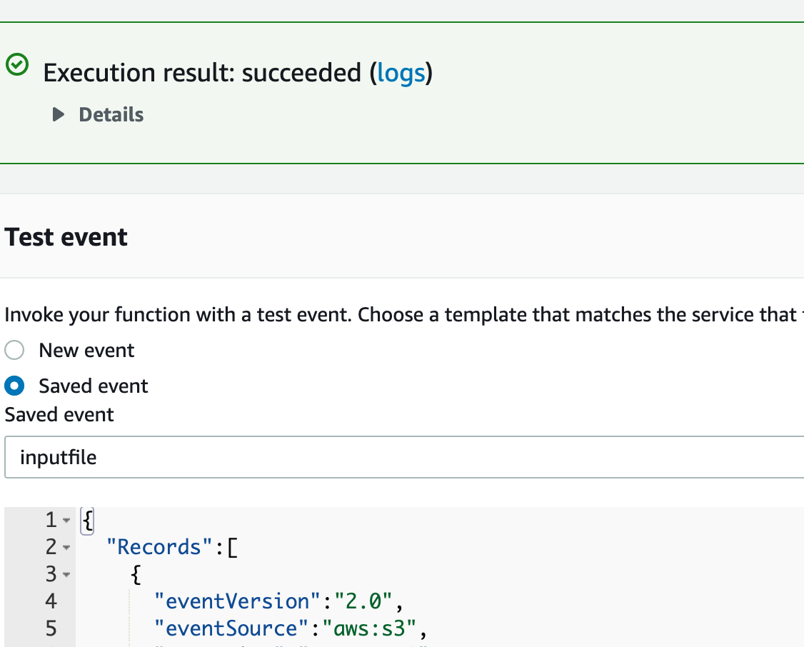

# Lab 17: AWS: S3 and Lambda

Deploy a Node.js server to AWS EC2

## Author: Jason Quaglia

- [link to github repository](https://github.com/jquaglia/image-lambda)

## Processes

- Ensure you have AWS developer account

- Ensure you have your access and secret keys inputted in the aws CLI

- [direct link to amazon instructions found below](https://docs.aws.amazon.com/lambda/latest/dg/with-s3-example.html)

- follow the instructions and set all the persmissions and roles you need are going to need.

### Create buckets and upload a sample object

Follow the steps to create buckets and upload an object.

1. Open the [Amazon S3 console.](https://console.aws.amazon.com/s3)

2. Create two buckets. The target bucket name must be `source` followed by _-resized_, where `source` is the name of the bucket you want to use for the source. For example, mybucket and mybucket-resized.

3. In the source bucket, upload a .jpg object, HappyFace.jpg.
When you invoke the Lambda function manually before you connect to Amazon S3, you pass sample event data to the function that specifies the source bucket and HappyFace.jpg as the newly created object so you need to create this sample object first.

### Create the IAM Policy

Create an IAM policy that defines the permissions for the Lambda function. The required permissions include:

- Get the object from the source S3 bucket.

- Put the resized object into the target S3 bucket.

- Permissions related to the CloudWatch Logs.

#### To create an IAM Policy

1. Open the [Policies page](https://console.aws.amazon.com/iam/home#/policies) in the IAM Console.

1. Choose __Create policy__

1. Under the __JSON__ tab, copy the following policy. Make sure the source and target bucket names match the bucket names that you created previously.

    ```json
    {
        "Version": "2012-10-17",
        "Statement": [
            {
                "Effect": "Allow",
                "Action": [
                    "logs:PutLogEvents",
                    "logs:CreateLogGroup",
                    "logs:CreateLogStream"
                ],
                "Resource": "arn:aws:logs:*:*:*"
            },
            {
                "Effect": "Allow",
                "Action": [
                    "s3:GetObject"
                ],
                "Resource": "arn:aws:s3:::mybucket/*"
            },
            {
                "Effect": "Allow",
                "Action": [
                    "s3:PutObject"
                ],
                "Resource": "arn:aws:s3:::mybucket-resized/*"
            }
        ]
    }         
    ```

4. Choose __Review policy__, specify the policy name as AWSLambdaS3Policy, and create the policy.

### Create the execution role

Create the [execution role](https://docs.aws.amazon.com/lambda/latest/dg/lambda-intro-execution-role.html) that gives your function permission to access AWS resources.

__To create an execution role__

Open the [roles page](https://console.aws.amazon.com/iam/home#/roles) in the IAM console.

Choose __Create role.__

Create a role with the following properties.

__Trusted entity – AWS Lambda.__

__Permissions – AWSLambdaS3Policy.__

__Role name –__ `lambda-s3-role`.

The __AWSLambdaS3Policy__ policy has the permissions that the function needs to manage objects in Amazon S3 and write logs to CloudWatch Logs.

### Create the Lambda function

__To create the function__

- Create a Lambda function with the create-function command.

  ```html
  aws lambda create-function --function-name CreateThumbnail \
  --zip-file fileb://function.zip --handler index.handler --runtime nodejs12.x \
  --timeout 10 --memory-size 1024 \
  --role arn:aws:iam::123456789012:role/lambda-s3-role
  ```

  __Note:__
  If you are using AWS CLI version 2, add the following command parameters:

  ```html
  --cli-binary-format raw-in-base64-out
  ```

  The Lambda function in the last step uses a Node.js function handler of `index.handler`. This name reflects the function name as `handler`, and the file where the handler code is stored in `index.js`. For more information, see [AWS Lambda function handler in Node.js](https://docs.aws.amazon.com/lambda/latest/dg/nodejs-handler.html). It also specifies a runtime of nodejs12.x. For more information, see [Lambda runtimes](https://docs.aws.amazon.com/lambda/latest/dg/lambda-runtimes.html).

For the role parameter, replace the number sequence with your AWS account ID. The preceding example command specifies a 10-second timeout value as the function configuration. Depending on the size of objects you upload, you might need to increase the timeout value using the following AWS CLI command.

```html
aws lambda update-function-configuration --function-name CreateThumbnail --timeout 30
```

### __Test the Lambda function__

In this step, you invoke the Lambda function manually using sample Amazon S3 event data.

#### __To test the Lambda function__

1. Save the following Amazon S3 sample event data in a file and save it as __inputFile.txt__. You need to update the JSON by providing your `sourcebucket` name and a .jpg object key.

```json
{
  "Records":[
    {
      "eventVersion":"2.0",
      "eventSource":"aws:s3",
      "awsRegion":"us-west-2",
      "eventTime":"1970-01-01T00:00:00.000Z",
      "eventName":"ObjectCreated:Put",
      "userIdentity":{
        "principalId":"AIDAJDPLRKLG7UEXAMPLE"
      },
      "requestParameters":{
        "sourceIPAddress":"127.0.0.1"
      },
      "responseElements":{
        "x-amz-request-id":"C3D13FE58DE4C810",
        "x-amz-id-2":"FMyUVURIY8/IgAtTv8xRjskZQpcIZ9KG4V5Wp6S7S/JRWeUWerMUE5JgHvANOjpD"
      },
      "s3":{
        "s3SchemaVersion":"1.0",
        "configurationId":"testConfigRule",
        "bucket":{
          "name":"sourcebucket",
          "ownerIdentity":{
            "principalId":"A3NL1KOZZKExample"
          },
          "arn":"arn:aws:s3:::sourcebucket"
        },
        "object":{
          "key":"HappyFace.jpg",
          "size":1024,
          "eTag":"d41d8cd98f00b204e9800998ecf8427e",
          "versionId":"096fKKXTRTtl3on89fVO.nfljtsv6qko"
        }
      }
    }
  ]
}
```

2. Run the following Lambda CLI invoke command to invoke the function. Note that the command requests asynchronous execution. You can optionally invoke it synchronously by specifying RequestResponse as the invocation-type parameter value.

```html
aws lambda invoke --function-name CreateThumbnail --invocation-type Event \
--payload file://inputFile.txt outputfile.txt
```

__Note:__
If you are using AWS CLI version 2, add the following command parameters:

```html
--cli-binary-format raw-in-base64-out
```

3. Verify that the thumbnail was created in the target bucket.

## Issues I ran in to

Most of the issues I had were permission based. I had to add roles and permissions/policies to my user to be able to create or invoke the function.

```html
An error occurred (AccessDeniedException) when calling the Invoke operation: User: arn:aws:iam::302651359699:user/jasonQ is not authorized to perform: lambda:InvokeFunction on resource: arn:aws:lambda:us-west-2:302651359699:function:CreateThumbnail
```

The above was essentially the most common error I found. I ended up figuring it out by adding to some policies and roles.

These are some photos of proof of life.




